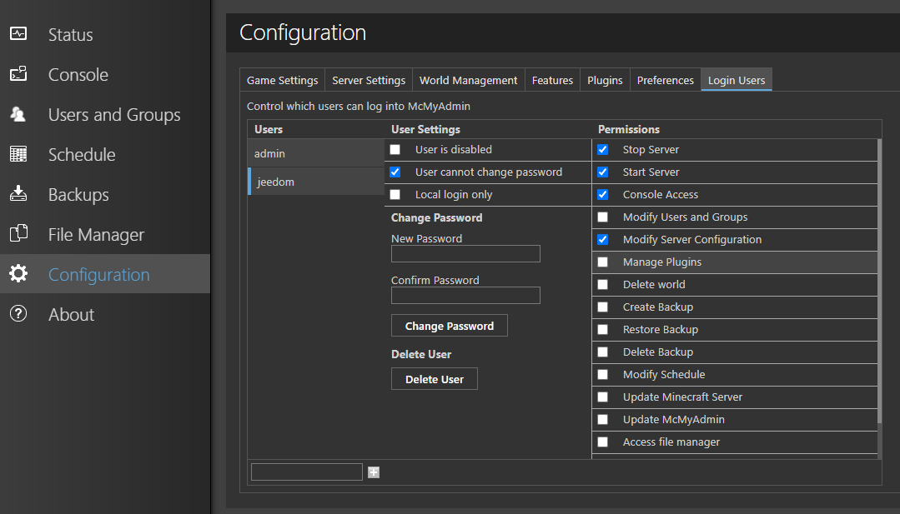
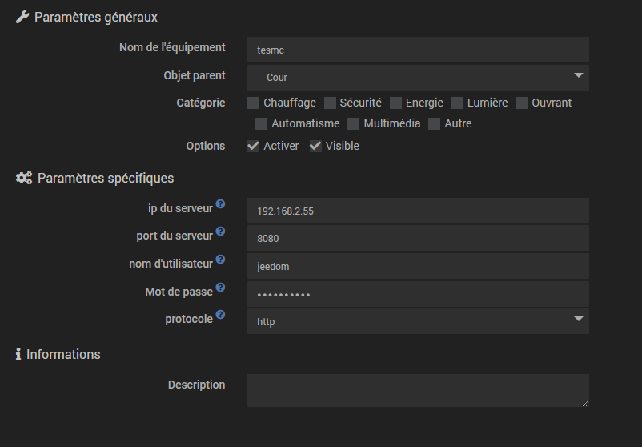
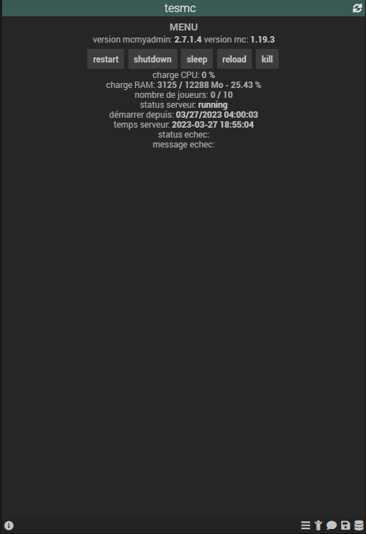
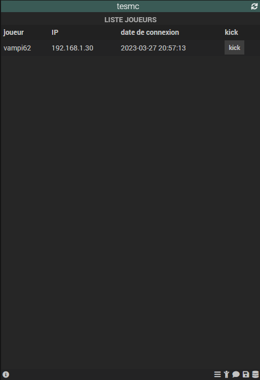
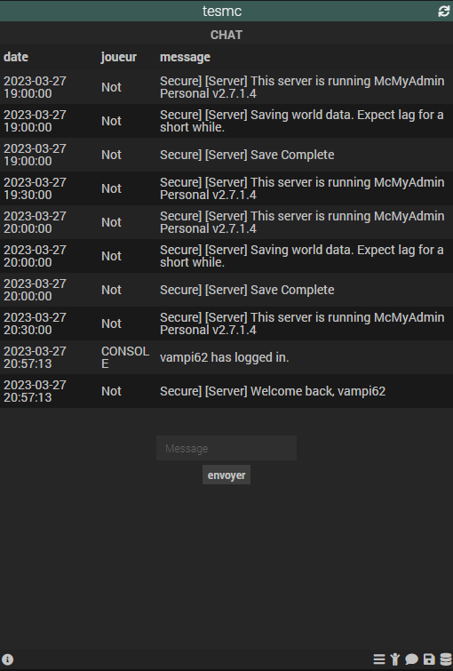
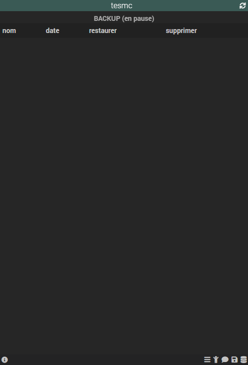
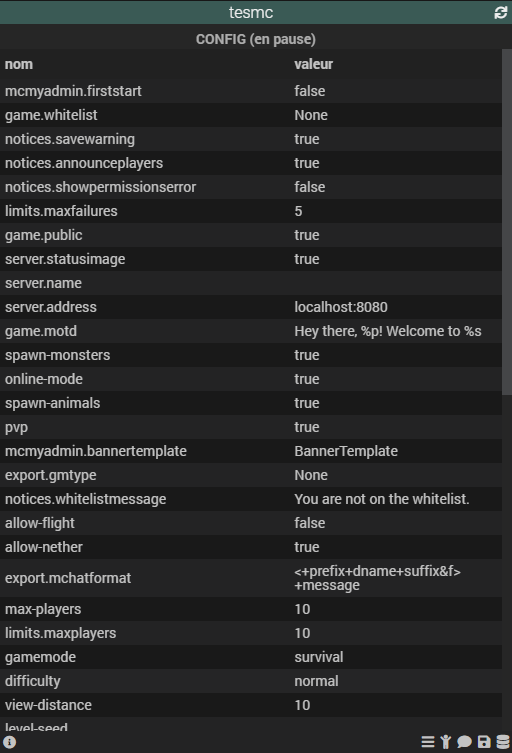

# Plugin mcmyadmin

Ce plugin permet de connecter un serveur Minecraft utilisant le panel mcmyadmin.

Le panel mcmyadmin est gratuit pour 10 joueurs et peut être téléchargé sur le site officiel : https://mcmyadmin.com/. Il existe aussi une image sur DockerHub : tekgator/docker-mcmyadmin:latest

Le plugin permet à Jeedom d'effectuer des actions de base telles que :
- Le démarrage, l'arrêt ou le redémarrage du serveur.
- Le poste de message ou de commande dans la console du serveur.
- La liste des utilisateurs connectés, des derniers messages du chat et la configuration du serveur.

## 1. Configuration

Vous pouvez choisir sur cette page le nombre de messages du chat à récupérer sur chaque serveur.

## 2. Configuration du compte sur mcmyadmin

Créez un compte sur le serveur mcmyadmin. (Ce compte ne doit servir qu'à la communication avec Jeedom). Pour ce faire, allez sur Configuration > Login Users. Le compte doit disposer au minimum des droits sélectionnés dans l'image ci-dessous.

## 3. Configuration du serveur sur Jeedom

Renseignez les informations de connexion :
- IP ou nom de domaine si le serveur se trouve en dehors du réseau de Jeedom
- Port du serveur
- pseudo de l'utilisateur sur mcmyadmin
- Mot de passe de l'utilisateur sur mcmyadmin
- Sélection HTTP ou HTTPS

## 4. Widget

Dans le dashboard, en bas de la tuile de votre objet, il y a plusieurs icônes cliquables permettant de naviguer entre les vues de la tuile (menu, joueurs, chat, backup, config).

### 4.1. Menu

Dans le menu (page par défaut), vous pouvez accéder aux commandes du serveur et autres informations globales.

### 4.2. Joueurs

La liste des joueurs connectés avec la possibilité de les expulser du serveur.

### 4.3. Chat

Postez des messages dans le chat ou utilisez "/" au début pour envoyer une commande dans la console.

### 4.4. Backups

Liste des sauvegardes (aucune action disponible pour le moment).

### 4.5. Config

Liste des configurations du serveur Minecraft et du panel (aucune action disponible pour le moment).

